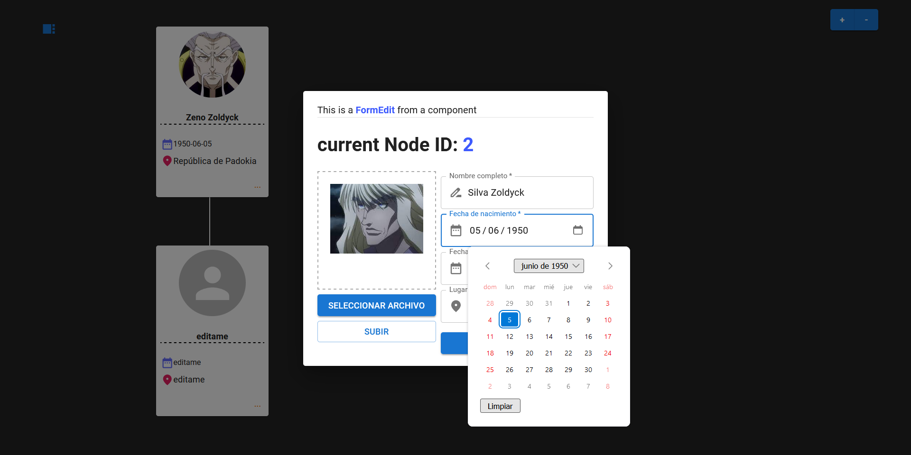

# Chrono Tree

Create your family tree quickly and easily, add photos, stories, and build your own collection of family history.

## Technologies used 

* Nodejs
* Sqlite
* React
* Typescript
* MaterialUI
* Express
* Prisma
* Jsonwebtoken
* Multer

## Welcome Page

## Login

## User Registration

## Upload Image

## Update Node

## Add child

## Add spouse

## Complete family tree

## Sidebar

